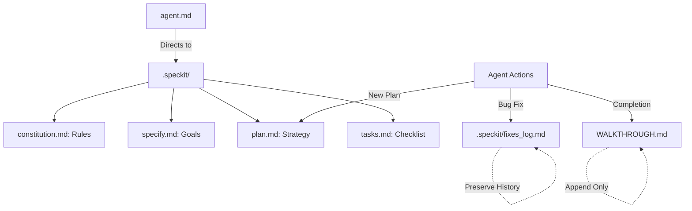

# Constitution

This document defines the principles, standards, and rules for the AI Tax Engine project.

## Core Principles
1. **Accuracy**: All tax-related information must be sourced from official government documents.
2. **Security**: User data and API keys must be handled with maximum security.
3. **Clarity**: The UI should be intuitive and helpful for users navigating complex tax rules.
4. **Source-Grounded**: Every tax rule must link back to a verified legal source or section.
5. **History Preservation**: Never overwrite previous entries in logs (`fixes_log.md`, `WALKTHROUGH.md`). Always append new information to maintain a complete audit trail.

## Core Vision (MOTO)
The primary goal of this platform is to make tax knowledge highly accessible, engaging, and easy to understand.
- **Gamified Experience:** The website must feel like playing a game, engaging enough that even a younger person could use it without getting bored.
- **Simplification:** Break down complex filing procedures and rules into interactive, visual walkthroughs.
- **Comprehensive:** Cover both individual and business tax planning, regime comparisons, and ITR form selection intuitively.

## Project Connectivity Map

The following diagram illustrates how agents navigate and manage the project documentation:

## Coding Standards
- Use TypeScript for all new components.
- Follow MVC-like structure where logic, view, and data are separated.
- Use reusable components for consistency.
- Maintain comprehensive logging for debugging.

## Development Workflow
- Follow the Spec-Driven Development (SDD) process using `.speckit` files.
- Specifications must be updated before implementation.
# Constitution.md

# Project Constitution

## Mission

This platform is not being built as a normal tax filing website.

The mission is to build a smart, user-friendly, educational, interactive, and intelligent Indian tax + compliance platform that helps ordinary people understand taxation, business registration, compliance, and financial decision-making without requiring technical, legal, or finance expertise.

The platform should simplify complex systems and help users make informed decisions with confidence.

The platform should behave like:

* a guided assistant,
* a decision-support system,
* an educational ecosystem,
* and eventually an intelligent fintech + legal-tech platform.

---

# Vision

The long-term vision is to create a trusted Indian platform where users can:

* learn,
* calculate,
* decide,
* track,
* manage,
* and understand taxation and compliance in one place.

The platform should transform taxation and compliance from a confusing legal process into a guided, understandable, and confidence-building experience.

The platform should reduce fear, confusion, and dependency caused by overly technical tax systems.

The platform should always prioritize:

* simplicity,
* clarity,
* transparency,
* guidance,
* trust,
* and user education.

---

# Core Philosophy

Most people:

* do not understand taxes,
* do not know which registrations are required,
* do not understand deductions,
* do not know which business structure suits them,
* do not know which compliances apply,
* and often feel intimidated by taxation systems.

This platform exists to solve that problem through:

* guided workflows,
* intelligent questioning,
* contextual explanations,
* interactive systems,
* personalized recommendations,
* and beginner-friendly experiences.

The platform must never assume users understand taxation terminology.

Every major workflow should:

1. Explain concepts simply
2. Guide users step-by-step
3. Reduce confusion
4. Build confidence
5. Help users take action

---

# Product Direction

The platform should evolve into a scalable fintech + legal-tech ecosystem for India.

The system should eventually support:

* tax calculations,
* tax planning,
* tax comparison,
* business registration guidance,
* compliance tracking,
* filing assistance,
* AI-powered guidance,
* educational systems,
* automated reminders,
* document analysis,
* and personalized dashboards.

The platform should support both:

* self-service users,
* and professional consultation workflows.

---

# Product Experience Principles

The platform must never feel:

* boring,
* intimidating,
* overly technical,
* outdated,
* or difficult to use.

The experience should feel:

* modern,
* premium,
* interactive,
* guided,
* visual,
* intelligent,
* and beginner-friendly.

The UI/UX should:

* reduce anxiety around taxation,
* simplify decision-making,
* encourage exploration,
* and maintain user engagement.

The platform should always answer:
“What should the user do next?”

---

# Trust & Transparency Principles

Trust is one of the most important pillars of the platform.

The platform must:

* clearly explain recommendations,
* show tax breakdowns transparently,
* avoid hidden logic,
* explain calculations,
* and use simple language before technical language.

Users should feel:

* informed,
* safe,
* guided,
* and confident.

The platform should prioritize:

* data privacy,
* secure document handling,
* and transparent guidance.

---

# Educational Philosophy

Education is a core feature, not an optional feature.

Every feature should educate users while helping them complete tasks.

Complex tax language should always be translated into:

* simple explanations,
* real-life examples,
* visual guidance,
* and contextual learning.

The platform should support:

* beginner users,
* business owners,
* freelancers,
* salaried employees,
* creators,
* and startups.

The system should eventually support multilingual and regional-language experiences for accessibility across India.

---

# Smart Guidance System

The platform should use adaptive and conditional workflows.

The system should dynamically ask intelligent questions based on:

* user type,
* business type,
* income category,
* registration requirements,
* and compliance applicability.

Example:
If a user selects “Capital Gains,” the platform should dynamically ask:

* property or shares,
* short-term or long-term,
* mutual funds or equity,
* residential or commercial assets.

The platform should guide users even when they do not know what information is relevant.

The system should prioritize:

* contextual guidance,
* adaptive flows,
* and intelligent questioning.

---

# Tax Calculation Philosophy

The tax calculator should not behave like a normal static calculator.

The calculator must:

* educate while calculating,
* explain tax concepts,
* classify income properly,
* guide deduction selection,
* compare tax regimes,
* calculate surcharge and cess,
* and explain why a recommendation is better.

The platform should help users understand:

* how tax is calculated,
* why deductions matter,
* which regime is suitable,
* and what affects final tax liability.

The platform should support:

* salary income,
* house property,
* business/profession,
* capital gains,
* other sources,
* clubbing,
* and future tax extensions.

---

# Business Registration Philosophy

The platform should help users decide:

* which business structure suits them,
* which registrations are required,
* which compliances apply,
* and what future operational implications exist.

The recommendation engine should consider:

* ownership structure,
* liability,
* scalability,
* funding goals,
* taxation,
* operational complexity,
* and compliance burden.

The system should support:

* Proprietorship,
* Partnership,
* LLP,
* OPC,
* Private Limited Company,
* Trust,
* Society,
* and Section 8 Company guidance.

---

# Compliance Philosophy

The platform should proactively help users manage compliance responsibilities.

Users should be able to:

* track deadlines,
* receive reminders,
* understand penalties,
* and know what actions are pending.

The system should eventually support:

* GST filings,
* TDS filings,
* ROC compliance,
* MSME filings,
* PF/ESI compliance,
* annual returns,
* and business-specific compliance tracking.

---

# Dashboard Philosophy

## User Dashboard

Users should have access to:

* saved calculations,
* filing history,
* compliance reminders,
* notices,
* personalized next actions,
* document storage,
* and progress tracking.

The dashboard should behave like a personalized financial/compliance assistant.

---

## Admin Dashboard

The platform should support a powerful no-code or low-code admin system.

Admins should be able to:

* update tax slabs,
* manage deduction rules,
* control workflows,
* create dynamic forms,
* update compliance rules,
* manage educational content,
* manage notifications,
* and modify user experiences without editing core code.

The admin architecture should support scalable operational management.

---

# AI + Human Assistance Philosophy

The platform should combine:

* intelligent automation,
* and human professional support.

AI should help users:

* understand,
* calculate,
* compare,
* and navigate workflows.

Human experts should support:

* critical filings,
* legal complexity,
* notices,
* and professional consultation.

The platform should balance:

* automation,
* trust,
* and professional reliability.

---

# Technical Philosophy

The architecture must be:

* modular,
* scalable,
* API-ready,
* secure,
* maintainable,
* and future-proof.

The platform should support:

* AI integrations,
* dynamic workflows,
* rule engines,
* document systems,
* notification systems,
* analytics,
* and large-scale user growth.

The backend should prioritize:

* reusable logic systems,
* configurable tax engines,
* admin-controlled workflows,
* and extensible architecture.

The platform should be designed for long-term scalability, not short-term shortcuts.

---

# Monetization Philosophy

The platform should combine:

* free education,
* self-service tools,
* premium services,
* and expert assistance.

Possible monetization layers include:

* tax filing services,
* business registration services,
* compliance subscriptions,
* premium dashboards,
* AI-powered reports,
* consultation services,
* and enterprise/business plans.

The platform should create trust before monetization.

---

# Competitive Advantage

The platform’s competitive advantage should come from:

* simplicity,
* intelligent guidance,
* beginner-first UX,
* interactive education,
* transparency,
* and humanized taxation experiences.

The goal is not just to provide services.

The goal is to make users feel:

* informed,
* empowered,
* confident,
* and financially aware.

---

# Non-Negotiable Rules

1. Never prioritize complexity over clarity.
2. Never assume users understand tax terminology.
3. Always explain before asking for information.
4. Keep workflows guided and interactive.
5. Reduce fear and confusion around taxation.
6. Make the platform visually engaging and modern.
7. Build for both beginners and advanced users.
8. Prioritize transparency and trust.
9. Keep architecture scalable and modular.
10. Every major feature must provide educational value.
11. The platform should always help users understand what to do next.
12. User experience should feel supportive, not intimidating.
13. Avoid static and form-heavy experiences whenever possible.
14. Design systems that can evolve with future Indian tax regulations.
15. Prioritize long-term product quality over short-term shortcuts.

---

# Founder Intent

This platform is being built to democratize access to tax and compliance knowledge in India.

The mission is not only to provide services, but to empower users with understanding, confidence, and decision-making ability regardless of their financial background.

The platform should eventually become:

* a trusted assistant,
* a compliance manager,
* a financial guide,
* and a modern intelligent ecosystem for Indian taxation and business compliance.
