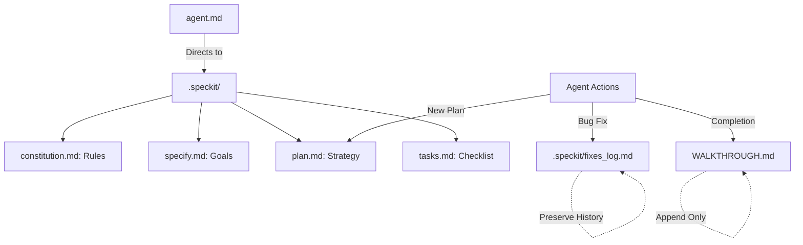

# Constitution

This document defines the principles, standards, and rules for the AI Tax Engine project.

## Core Principles
1. **Accuracy**: All tax-related information must be sourced from official government documents.
2. **Security**: User data and API keys must be handled with maximum security.
3. **Clarity**: The UI should be intuitive and helpful for users navigating complex tax rules.
4. **Source-Grounded**: Every tax rule must link back to a verified legal source or section.
5. **History Preservation**: Never overwrite previous entries in logs (`fixes_log.md`, `WALKTHROUGH.md`). Always append new information to maintain a complete audit trail.

## Project Connectivity Map

The following diagram illustrates how agents navigate and manage the project documentation:

## Coding Standards
- Use TypeScript for all new components.
- Follow MVC-like structure where logic, view, and data are separated.
- Use reusable components for consistency.
- Maintain comprehensive logging for debugging.

## Development Workflow
- Follow the Spec-Driven Development (SDD) process using `.speckit` files.
- Specifications must be updated before implementation.
